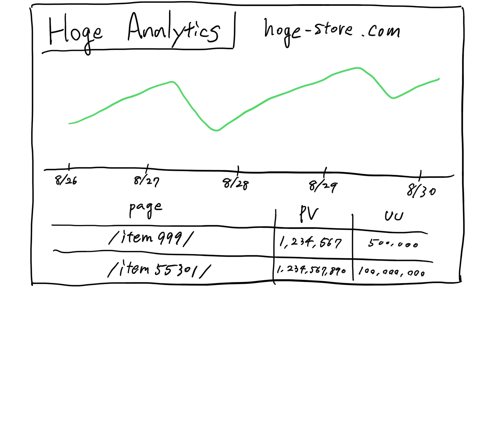
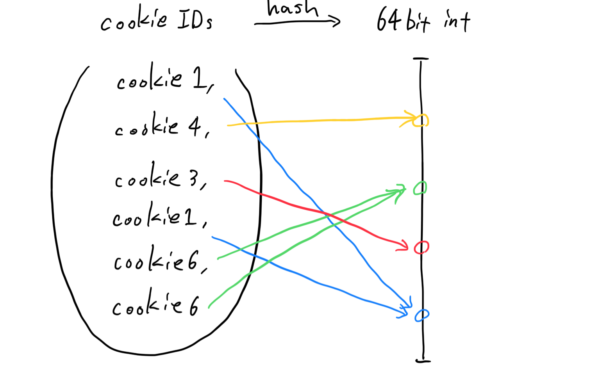
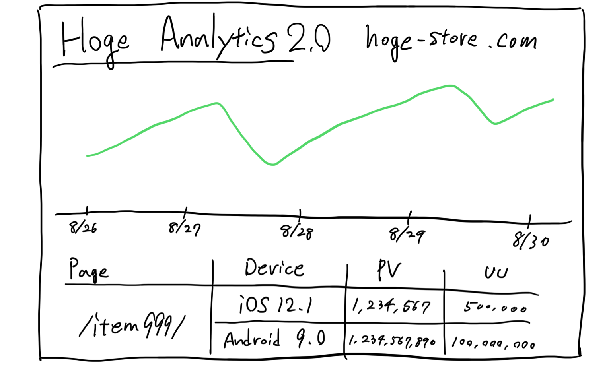

## HyperLogLog sketchは面白い

### builderscon tokyo 2019
#### Haruki Okada (@ocadaruma)

---

## Introduction

- リアルタイムアクセス解析システム "HogeAnalytics" を作るとする
- Webサイトのアクセス統計をリアルタイムに提供
  - ページごとのPV数
  - ページごとのユニークユーザー(cookie)数

---



---


---

## Difficulty

- PV数: `Map<PageURL, Long>`を的なのを持ち、アクセスのたびにインクリメントすればよい
- ユニークユーザー数: どうやって出すか？
  - Count-distinct problemとよばれる
  - ナイーブな方法だと非効率になる

---

## Simple set approach

```java
class UniqueUserStats {
  private Map<PageURL, Set<CookieId>> map;

  public void record(PageURL url, CookieId user) {
    Set<CookieId> set = map.get(url);
    set.add(user);
  }

  public int countUU(PageURL url) {
    Set<CookieId> set = map.get(url);
    return set.size();
  }
}
```

---

## Simple set approach

- O(N) space必要 (N = ユニークユーザー数)
- UUID StringのcookieIdを考える(36 byte)
  - 1億UUの保存に3.6GB
  - 100URLで360GB
  - たくさんのWebサイトを計測することを考えるとリーズナブルじゃない
- abuse耐性が無い
  - でたらめなcookieIdを送り続けるといずれMemoryに保持できる数を超えてサーバーが死ぬ

---

## Batch approach

- 以下のようなSQLで事前にUU数を集計しておく

```sql
SELECT
  url, COUNT(DISTINCT cookie_id) uu
FROM
  access_log
GROUP BY
  url
```

- "リアルタイム"要件をみたせない

---

## Solution: Probabilistic approach

- 確率的アルゴリズムによる近似値を使う
- **HyperLogLog**
  - Philippe Flajolet et al., 2007. HyperLogLog: the analysis of a near-optimal cardinality estimation algorithm
  - 集合のCardinality(要素数)をO(1) spaceで高精度に近似できる
  - このスライドでは以下HLLと省略

---

## Agenda

1. How HLL works
2. HLL on Redis
3. Deep dive into Redis HLL
4. HyperMinHash

---

# How HLL works

---

## Intuitive explanation

- 64bit intを一様ランダムに選ぶとき、先頭から0がk bit連続している確率は`1/2^k`


---

## Intuitive explanation

- 言いかえると、`2^k`回試行しないと先頭から0がk bit連続する数が出ない
- 「64bit intを一様ランダムに選ぶ」ことを繰り返すとき「最大で先頭から0が何bit連続したか」だけ記録しておけば「試行した回数」を推定できる

---

## Use hash function for randomization

- よい64bit hash関数を使うと、hash値は64bit int空間に一様に分布する
- つまり、cardinalityが`N`であるデータセットの要素をhash関数にかける ⇔ 「64bit intを一様ランダムに選ぶ」試行をN回繰り返す

---



---

## What does "LogLog" means

- いま、cardinality `N` を「先頭から連続する0のbit数」で近似した
- つまり`log2(N)`までの数を保持できればよい
- `log2(log2(N))` bit

---

## Stochastic averaging

- これだけだと精度が悪いし、2^k単位でしか近似できない
- ハッシュ値の先頭`p` bitを使って、`m=2^p`個のbucketに振り分ける
- bucketごとに、`64-p` bitのうち先頭から連続する0のbit数を保持する
- bucketごとの値をいい感じに足し合わせる

---


---

## Entire HLL algorithm 

---

## HLL is a random variable

- HLLは任意のデータセットに対して前述のアルゴリズムで値を定める確率変数である
- この確率変数の期待値がcardinality `n`に等しい
- 精度の評価は統計の手法を使う

---

### Accuracy

- bucket数を`m`としたとき、標準誤差 = `1.04/√m`
  - Flajolet et al., 2007.
  - ここでいう標準誤差 := 標準偏差を真のcardinalityで割って得た相対誤差
  - Redisはdefaultだと16384 bucketなので`1.04/√16384 = 0.008125`
  - => 誤差0.81%

---

## Accuracy

- 「どんな入力に対しても誤差が0.81%以内」という意味ではない
- 例: Redis 4.0.9で以下の入力は相対誤差-90%となる

```
$ redis-cli PFADD foo 98567648 19857710 293736832 \                                                                                                                                                  master
                      275337325 304058906 154945851 \
                      227134849 290132289 168593923 \
                      279957693
$ redis-cli PFCOUNT foo
(integer) 1
```

---

## What causes high error ?

- ハッシュ値の衝突（自明）
  - 一般的にはハッシュのpre imageを求めるのは困難
- 同じbucket、同じ先頭の0 bit数となる場合

---

## HLL sketch

- 先頭の連続する0のbit数を保持した`m`個のbucketをsketchとよぶ

```java
class HLLSketch {
    private static final int M = 16384;
    private byte[] buckets = new byte[M];
}
```

---

## Sketch and estimator

- HLL sketchはFlajolet et al. (2007)が初出ではない

---

## Improve sketch

---

## Improve estimator

---

# HLL on Redis

---

## Using HLL on Redis

- RedisのHLL関連commandは`PFxxx`

```bash
$ for i in `seq 1000`; do
  redis-cli PFADD foo $i > /dev/null
done

$ redis-cli PFCOUNT foo
(integer) 1001
```

---

## Mergeability

---

## Performance

---

## Deep dive into Redis HLL

- http://antirez.com/news/75

---

## Redis v4

---

## Redis v5

---

## Redis HLL vulnerability

---

# HyperMinHash

---

## Intersection cardinality

- HLLを使うことで省メモリにcardinalityを保持・計算でき、unionも取れることがわかった
- unionが取れるならintersectionも欲しくなる

---

### Hoge Analytics 2.0



---

## Difficulty

- 以下のディメンションを任意に組み合わせたい
  - 地域 (100種類)
  - URL (100ページ)
  - OS (10種類)
  - 流入キーワード (10000種類)
  - 流入元サイト (1000サイト)
- 1兆通り
  - Redisの場合、sketchは12KB => 計12PB

---

## Probabilistic approach again

- **MinHash**
  - Jaccard Indexを近似する確率的アルゴリズム

---

## MinHash and HyperLogLog

- 

---

## HyperMinHash

---

## Conclusion

- HyperLogLog sketchは面白い
- 確率的アルゴリズムは面白い
