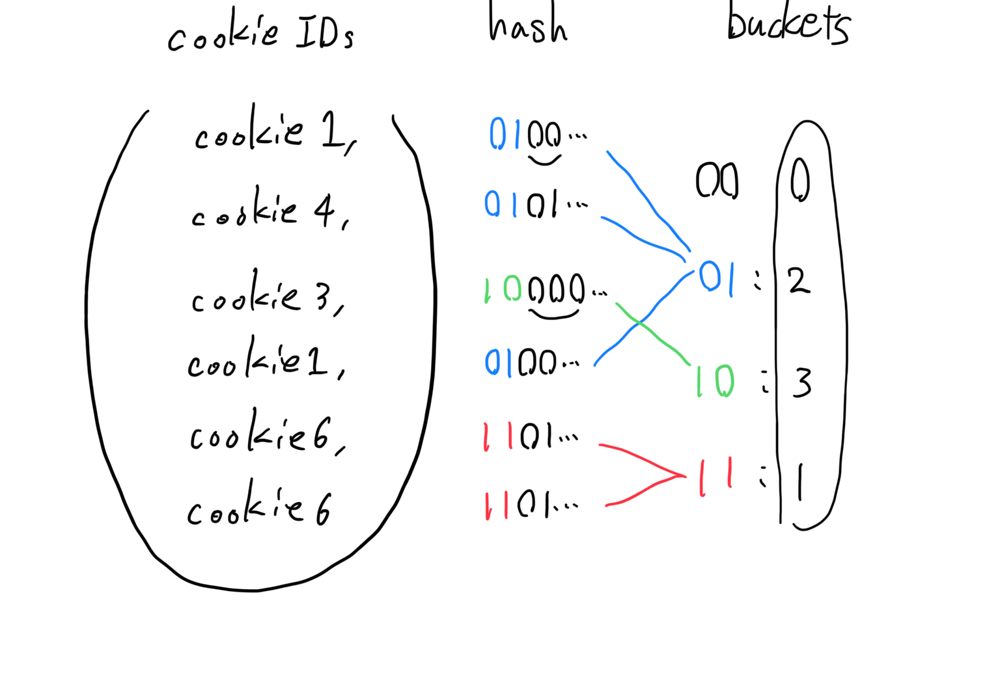
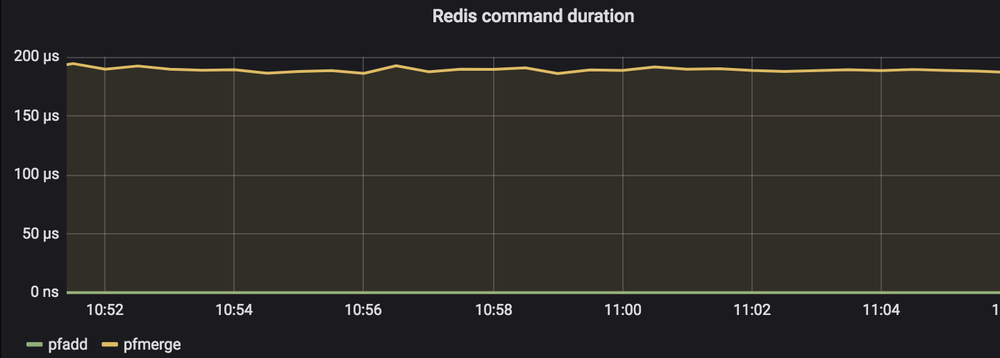

## HyperLogLog sketchは面白い

### builderscon tokyo 2019
#### Haruki Okada (@ocadaruma)

---

## Introduction

- リアルタイムアクセス解析システム`HogeAnalytics`を作りたい
- Webサイトのアクセス統計をリアルタイムに提供
  - ページごとのPV数
  - ページごとのユニークユーザー(cookie)数

---

<br>


---


---

## Difficulty

- PV数: アクセスがあるたびにintegerをインクリメントすればよい
  - URLあたり4 byteとか8 byte
- ユニークユーザー数: どうやって出す？
  - Count-distinct problemとよばれる
  - すべての要素を覚えておく必要があるため、ナイーブな方法だとどうしても非効率になる

---

## Simple set approach

```java
class UniqueUserStats {
  private Map<PageURL, Set<CookieId>> map;

  public void record(PageURL url, CookieId user) {
    Set<CookieId> set = map.get(url);
    set.add(user);
  }

  public int countUU(PageURL url) {
    Set<CookieId> set = map.get(url);
    return set.size();
  }
}
```

---

## Simple set approach

- O(N) space必要 (N = ユニークユーザー数)
- UUID StringのcookieIdを考える(36 byte)
  - 1億UUの保存に3.6GB
  - 100URLで360GB
- abuse耐性が無い
  - でたらめなcookieIdを送り続けるといずれメモリに保持できる数を超えてサーバーが死ぬ

---

## Batch approach

- 以下のようなSQLで事前にログを集計して、たとえばMySQLなどのレポートDBに入れておく

```sql
SELECT
  url, COUNT(DISTINCT cookie_id) uu
FROM
  access_log
GROUP BY
  url
```

- "リアルタイム"がみたせない

---

## Solution: Probabilistic approach

- 確率的アルゴリズムによる近似値を使う
- **HyperLogLog**
  - Philippe Flajolet et al., 2007. HyperLogLog: the analysis of a near-optimal cardinality estimation algorithm
  - 集合のcardinality(要素数)をO(1) spaceで高精度に推定できる
  - このスライドでは以下HLLと省略

---

## HyperLogLog

- 様々なミドルウェアにHLLを用いたapprox distinctが搭載されている
  - Redis, Presto, Redshift, BigQuery,...
- 16KBで、数十億を超えるcardinalityを0.81%の誤差で近似

---

# Agenda

1. How HLL works
2. HLL on Redis
3. HyperMinHash

---

# How HLL works

---

## Intuitive explanation

- 64bit intを一様ランダムに選ぶとき、上位k bitが連続して0となる確率は`1/2^k`


---

## Intuitive explanation

- 言いかえると、`2^k`回試行しないと上位k bitが連続して0であるような数が出ない
- 「64bit intを一様ランダムに選ぶ」ことを繰り返すとき「上位何bit 0が連続したか」だけ記録しておけば「試行した回数」を推定できる

---

## Use hash function for randomization

- よい64bit hash関数を使うと、hash値は64bit int空間に一様に分布する
- つまり、cardinalityが`N`であるデータセットの要素をhash関数にかける ⇔ 「64bit intを一様ランダムに選ぶ」試行をN回繰り返す

---


---

## What does "LogLog" means

- いま、cardinality `N` を「上位の連続した0-bit数」で近似した
- つまり`log2(N)`までの数だけで`N`を近似したことになる
- `log2(log2(N))` bit

---

## Improve accuracy

- これだけだと精度が悪いし、2^k単位でしか近似できない
- 複数のhash関数を使ってその平均を取ることで精度が向上する

---

## Improve accuracy

- データセットの各要素に対し複数のhash関数をかけるのは時間がかかる
- かわりに、ハッシュ値の先頭`p` bitを使って、`m = 2^p`個のbucketに振り分ける
- bucketごとに、残りの`64 - p` bitを使って、上位の連続する0-bitを数える

---

<br>



---

## HLL Sketch

- この、上位の連続する0-bit数を保持した`m`個のbucket列をsketchとよぶ

```java
byte[] sketch = new byte[m];
```

---

## Stochastic averaging

- sketchを走査し、bucketごとの値を平均して最終的な値を計算する
  - Flajolet & Martin., 1985. Probabilistic Counting Algorithms for Data Base Applications

---

## Estimation

- sketchをMとしてM[i]でi番目のbucketを表すと、HLLでは以下の式で最終的なcardinalityを計算する
- (`αm`は、bucket数`m`に依存したbias correction factor)


---

## Entire HLL process

- したがってHLLは2 stepにわけられる
- (1) Sketch construction
  - データセットを走査して各要素をbucketに振り分け、上位の連続する0-bitを数えて保存
  - データセットの要素数を`N`とすると `O(N)` time
- (2) Estimation
  - sketchを走査して、前述の式でcardinalityを計算する
  - bucket数は固定なので`O(1)` time

---

## Pseudo code

- Sketch construction

```java
byte[] sketch = new byte[m];

for (String element : dataset) {
    long hash = calcHash(element);
    int bucket = calcBucket(hash);
    byte leadingZeros = calcLeadingZeros(hash);
    
    sketch[bucket] = Math.max(sketch[bucket], leadingZeros);
}
```

---

## Pseudo code

- Estimation

```java
double z = 0;
for (byte leadingZeros : sketch) {
    z += 1.0 / Math.pow(2, leadingZeros);
}

return alpha * m * m / z;
```

---

## HLL is a random variable

- HLLは任意のデータセットに対して前述のアルゴリズムで値を定める確率変数である
- この確率変数の期待値がcardinality `n`に等しいということ

---

## Accuracy

- bucket数を`m`としたとき、標準誤差 = `1.04/√m`
  - by Flajolet et al., 2007.
  - ここでいう標準誤差 := 標準偏差を真のcardinalityで割って得た相対誤差
  - Redisはデフォルトだと16384 bucketなので`1.04/√16384 = 0.008125`
  - => 誤差0.81%

---

## Accuracy

- 「どんな入力に対しても誤差が0.81%以内」という意味ではない
- 例: Redis 4.0.9で以下の入力は相対誤差-90%となる

```
$ redis-cli PFADD foo 98567648 19857710 293736832 \                                                                                                                                                  master
                      275337325 304058906 154945851 \
                      227134849 290132289 168593923 \
                      279957693
$ redis-cli PFCOUNT foo
(integer) 1
```

---

## What causes high error ?

- ハッシュ値の衝突
  - だが一般的にはハッシュのpre imageを求めるのは困難
- 同じbucketへ振り分けられて、かつ上位0 bitが同じ数連続している場合
  - 前述の98567648, 19857710,...はすべて、Redis HLLにおいて同じbucketかつ同じ数0-bit数が連続する

---

## HLL feature: Streaming update

- HLL sketch全体を再構築することなく要素を追加できる

```java
public void add(String element) {
    long hash = calcHash(element);
    int bucket = calcBucket(hash);
    byte leadingZeros = calcLeadingZeros(hash);

    sketch[bucket] = Math.max(sketch[bucket], leadingZeros);
}
```

---

## HLL feature: Merge two sketches

- ２つのHLL sketchはloss lessでmergeできる
  - (bucket数やhash関数は同じ前提)


---

## HLL feature: Merge two sketches

```java
public byte[] merge(byte[] sketch1, byte[] sketch2) {
    int m = sketch1.length;
    byte[] merged = new byte[m];
    
    for (int i = 0; i < m; i++) {
        merged[i] = Math.max(sketch1[i], sketch2[i]);
    }
    
    return merged;
}
```

---

## HLL feature: Easy to parallelize

- mergeがloss lessなので、大量のデータセットのHLL sketch構築は容易に並列化できる


---

## Sketch & Estimation

- HLL sketchはFlajolet et al., 2007が初出ではない
  - Durand & Flajolet., 2003. Loglog Counting of Large Cardinalities
- sketch構築はHLLと同じだが、cardinalityの計算方法が違う


---

## LogLog-Beta

- Jason Qin et al., 2016. LogLog-Beta and More: A New Algorithm for Cardinality Estimation Based on LogLog Counting
- オリジナルのHLLはcardinalityが小さいときに誤差が大きくなる
- LogLog-Betaはすべてのcardinality rangeでよい精度を示す


---

## Otmar Ertl method

- Otmar Ertl, 2017. New cardinality estimation algorithms for HyperLogLog sketches
- Redis 5.0.5（現時点のlatest）で採用されているestimation
- これもsketchはオリジナルのHLLと同じで、計算方法が違う

---

# HLL on Redis

---

## Using HLL on Redis

- RedisのHLL関連commandは`PFxxx`
  - Philippe Flajoletに由来

```bash
$ for i in `seq 1000`; do
  redis-cli PFADD foo $i > /dev/null
done

$ redis-cli PFCOUNT foo
(integer) 1001
```

---

## Merge

```bash
$ for i in `seq 2000 2500`; do
  redis-cli PFADD bar $i > /dev/null
done

$ redis-cli PFMERGE merged foo bar
$ redis-cli PFCOUNT merged
(integer) 1506
```

---

## Get sketch

```bash
$ reids-cli PFADD baz 1

$ redis-cli GET baz
"HYLL\x01\x00\x00\x00\x00\x00\x00\x00\x00\x00\x00\x80]f\x80b\x97"
```

---

## Performance

- PFADD: < 1 microsec
- PFMERGE: ~ 200 microsec (okada調べ)
  - High trafficな場合は注意



---

## History

- Redis 2.8.9で導入
  - http://antirez.com/news/75
- Linear CountingとHLLの併用
  - HLLは小さいcardinalityに対して誤差が大きくなるため、閾値を超えるまではHLLでなくLinear Countingを使う
  - Flajolet et al., 2007でも提案されている手法

---

## Redis v4.0.0

- https://github.com/antirez/redis/pull/3677
- アルゴリズムがLogLog-Betaに切り替わった
  - Linear Countingを併用しなくなった

---

## Redis v5.0.0

- https://github.com/antirez/redis/pull/4749
- LogLog-Betaから、Otmar Ertl, 2017. によるアルゴリズムに切り替わった

---

## Redis HLL Representation

- RedisはHLL sketchを2通りでencodeする
  - sparse representation
  - dense representation
- Redis HLLは以下の構造を持つ

```c
struct hllhdr {
    char magic[4];      /* "HYLL" */
    uint8_t encoding;   /* HLL_DENSE or HLL_SPARSE. */
    uint8_t notused[3]; /* Reserved for future use, must be zero. */
    uint8_t card[8];    /* Cached cardinality, little endian. */
    uint8_t registers[]; /* Data bytes. */
};
```

hyperloglog.c 

---

## Sparse representation

- Redisデフォルトではregister数`m = 16384`
  - 以下Redisの用語と揃えてbucket = registerと表記
- cardinalityが小さいうちは、ほとんどのregisterは値が0のまま
- sketchをrun length encodingで圧縮して保持することで空間効率を高める

---

## Dense representation

- sparse representationの使用領域がしきい値を超えると、denseにpromoteされる
  - `hll_sparse_max_bytes` configで指定
- 1要素あたり6 bitの`m`要素の配列として表現
  - registerの値は高々64bitなので、`log2(64) = 6 bit`で十分

---

## Dense representation

- ただし6 bitのprimitiveは無いのでuint8_t arrayとして保持
  - `16384 * (6/8) = 12288` bytes
- bit shiftingでうまいことregisterの値を取り出す

---

# HyperMinHash

---

## Intersection cardinality

- HLLを使うことで省メモリにcardinalityを保持・計算でき、unionも取れることがわかった
- unionが取れるならintersectionも欲しくなる

---

### Hoge Analytics 2.0


---

## Difficulty

- 以下のディメンションを任意に組み合わせたい
  - 地域 (100種類)
  - URL (100ページ)
  - OS (10種類)
  - 流入キーワード (10000種類)
  - 流入元サイト (1000サイト)
- 1兆通り
  - Redisの場合、sketchは12KB => 計12PB

---

## Probabilistic approach again

- **MinHash**
  - Andrei Z. Broder, 1997. On the resemblance and containment of documents
  - Jaccard Indexを近似する確率的アルゴリズム


---

## HyperLogLog and MinHash

- AdRoll tech blogで紹介されている手法
  - http://tech.adroll.com/blog/data/2013/07/10/hll-minhash.html


---

## MinHash

- `N`をデータセットのcardinalityとすると、MinHash sketchは`O(log(N))` space必要
- HLLのように空間効率のよい表現がほしい

---

## HyperMinHash

- Yu & Weber, 2017. HyperMinHash: MinHash in LogLog space
- hash値のbitパターンをうまいことencodeして、`O(log(log(N)))` spaceで、MinHashとHLL両方の性質を実現
- Jaccard Indexの推定とHLLの推定が、HyperMinHash sketchのみで可能

---

# Conclusion

- HyperLogLog sketchは面白い
- 確率的アルゴリズムは面白い
